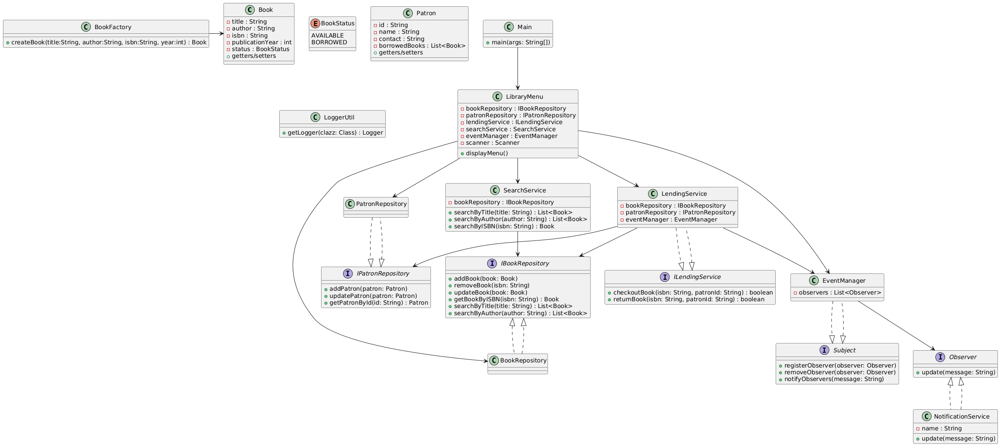
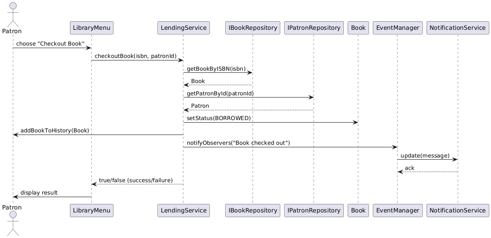

# 📚 Library Management System (Core Java)

A **menu-driven Library Management System** built in **Core Java** that demonstrates **Object-Oriented Programming (OOP)**, **SOLID principles**, and **design patterns**.  
This system allows librarians to manage **books**, **patrons**, and **lending processes** efficiently.

---

## ✨ Features

- 📖 **Book Management**
  - Add, remove, and update books
  - Search books by **title**, **author**, or **ISBN**

- 👤 **Patron Management**
  - Add and update patron details
  - Track borrowing history

- 🔄 **Lending Process**
  - Book checkout and return
  - Inventory updates automatically

- 📊 **Inventory Management**
  - Keep track of **available** and **borrowed** books

---

## ⚙️ Technical Highlights

- **OOP Concepts Used**:  
  Encapsulation, Abstraction, Polymorphism (through interfaces), Composition  

- **SOLID Principles Applied**:  
  - **S**ingle Responsibility – Each class has one responsibility  
  - **O**pen/Closed – New features can be added without modifying existing code  
  - **L**iskov Substitution – Interfaces (`IBookRepository`, `ILendingService`) followed  
  - **I**nterface Segregation – Separate interfaces for book and patron repositories  
  - **D**ependency Inversion – Services depend on abstractions, not implementations  

- **Design Patterns**:
  - 🏭 **Factory Pattern** → `BookFactory` for book creation  
  - 👀 **Observer Pattern** → `EventManager` and `NotificationService` for notifications  

- **Logging**:
  - Integrated with **log4j2** for logging key actions  

- **Collections**:
  - `List` and `Map` for managing books and patrons  

---


---

## 📊 UML Diagram

The following UML class diagram illustrates the system design:




---

## 🔄 Sequence Diagram – Book Checkout

The following sequence diagram shows the flow of the **checkout process**:




## ▶️ Running the Project

1. Clone the repository  
   ```bash
   git clone https://github.com/inquire-r/library-management-system.git
   cd library-management-system
2. Compile the project  
   ```bash
   javac -cp .;lib/log4j-core-2.x.jar;lib/log4j-api-2.x.jar src/com/librarymanagement/**/*.java

3. Run the application
   ```bash
   java -cp .;src;lib/log4j-core-2.x.jar;lib/log4j-api-2.x.jar com.librarymanagement.Main


## ▶️ Sample Menu

1. Add Book
2. Add Patron
3. Search Book by Title
4. Search Book by Author
5. Search Book by ISBN
6. Checkout Book
7. Return Book
8. Exit


---

## 📌 Conclusion

This **Library Management System** project is designed with **SOLID principles**, uses **design patterns (Factory & Observer)**, and follows a **menu-driven approach** for easy user interaction.  
Logging is handled using **Log4j**, ensuring maintainability and debugging support.  

The UML and Sequence Diagrams provide clear insights into the system’s structure and flow, making the design transparent and extensible for future enhancements.  

> 🚀 Future improvements can include adding a database layer, user authentication, and web-based UI for a complete digital library experience.  

---

